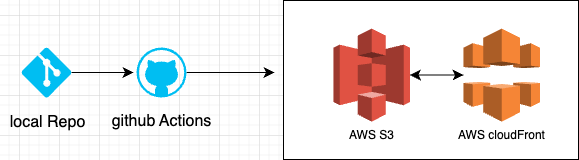

# 9주차 성능 최적화 과제

## 기본 과제: 프론트엔드 배포 파이프 라인

### 개요



GitHub Actions에 워크플로우를 작성해 다음과 같이 배포가 진행되도록 합니다.

(사전작업: Ubuntu 최신 버전 설치)

1. Checkout 액션을 사용해 코드 내려받기
2. `npm ci` 명령어로 프로젝트 의존성 설치
3. `npm run build` 명령어로 Next.js 프로젝트 빌드
4. AWS 자격 증명 구성
5. 빌드된 파일을 S3 버킷에 동기화
6. CloudFront 캐시 무효화

### 인프라 환경 구현 과정

1. git repo 구현
2. next.js 프로젝트 생성
3. Amazon S3 bucket 생성 및 폴더 업로드
4. Amazon Cloudfront와 S3 연동하여 배포
5. Amazon IAM 권한 정책 설정
6. git repo 환경 변수 추가 등록

```bash
 AWS_ACCESS_KEY_ID : aws IAM public accesskey
 AWS_SECRET_ACCESS_KEY : aws IAM private accesskey
 AWS_REGION : AWS region
 S3_BUCKET_NAME : s3 버킷 이름
 CLOUDFRONT_DISTRIBUTION_ID : CloudFront 배포 ID
```

### 주요 링크

- S3 버킷 웹사이트 엔드포인트: http://performance-juyoung.s3-website-us-east-1.amazonaws.com/
- CloudFrount 배포 도메인 이름: https://dy7o03uuc4sgv.cloudfront.net/

## 주요 개념

### GitHub Actions과 CI/CD 도구

#### GitHub Actions

"GitHub Actions는 개발의 효율성을 높이는데 사용합니다."

- 용도 및 정의
  GitHub Actions는 GitHub의 자동화 도구입니다. 단순한 것에서 복잡한 워크 플로우를 구축하여 소프트웨어 개발을 자동화하는데 사용됩니다.

- 특징

1. 개발, 테스트, 배포 등의 워크플로우를 깃헙 저장소 내에서 직접 관리할 수 있다.
2. yaml 파일을 활용하여 워크플로우를 쉽게 설정할 수 있다.
3. 외부 도구를 관리하거나 추가적인 인프라 설정이 필요 없다.
4. 다양한 플랫폼 지원 (Linux, Windows, macOS).
5. Github Free는 한달에 2000분 사용 가능하다.
6. 다양한 이벤트에 따라 실행하는 워크 플로우가 특징

#### CI/CD란?

- 정의
  CI(Continuous Integration) & CD(Continuose Delivery or Deployment)의 준말

- 용도
  CI : 레포지토리 내의 코드 변경 사항에 대해 자동으로 테스트 실행 하는데 사용, 즉 문제를 빠르게 발견해서 더 안정적으로 개발할 수 있게 도와준다.
  CD : 코드 변경 사항이 실제 배포 환경에 자동으로 배포

- 구성
  CI : 주로 PR이 Open 상태이거나 Synchronize될 경우 트리거
  CD : PR이 merge될 경우 트리거

### S3와 스토리지

"Amazon S3(Simple Storage Service)는 AWS에서 제공하는 객체 스토리지 서비스입니다."

Amazon S3는 다음과 같은 특징을 가집니다.
정적 웹 호스팅 HTML, CSS, JavaScript 파일을 호스팅하고, 웹사이트의 엔드포인트를 제공합니다. 또한 Route 53이나 CloudFront를 사용해서 도메인을 연결할 수 있습니다.
데이터 관리 파일의 여러 버전을 관리(버저닝)할 수 있습니다. 또한 수명 주기를 관리하고 객체를 잠금하는 등의 기능을 통해 효과적으로 데이터를 관리할 수 있도록 도와줍니다.
보안 기능 버킷의 정책을 설정해서 해당 버킷의 접근 권한을 설정할 수 있습니다. 또한 IAM 사용자별로 권한을 관리할 수 있습니다.

### CloudFront와 CDN

#### CDN

CDN은 정적 콘텐츠를 **사용자와 가장 가까운 서버(엣지 서버)**에서 제공하여 지연 시간 감소와 속도 향상을 이루는데 사용합니다. 주로 캐싱, 로드 밸런싱, 보안, 모니터링에 사용합니다. 편의점 예시가 너무 와닿아 이해하게 됐습니다. 또한 CDN은 SSL/TLS 인증서를 통해 HTTPS 통신을 제공하고, DDoS 공격으로부터 서버를 보호합니다.

#### CloudFront

CloudFront는 AWS에서 제공하는 CDN 서비스입니다.

CloudFront를 학습하며 다음과 같은 기능이 있는지 알게 됐습니다.

### 캐시 무효화(Cache Invalidation)

CloudFront의 캐시 무효화(Cache Invalidation)는 엣지 로케이션에 저장된 캐시된 콘텐츠를 제거하거나 갱신하는 과정으로, 웹사이트나 애플리케이션에서 업데이트된 파일이 사용자에게 즉시 반영되도록 합니다. 일반적으로 콘텐츠는 지정된 `TTL(Time To Live)` 동안 캐시되지만, 파일 수정 후 캐시가 만료되길 기다리지 않고 Invalidation 요청을 통해 강제로 캐시를 삭제할 수 있습니다. 발생한 장애를 대응하여 재배포했을 때, 반영이 되지 않는다면 해결 방법 중 하나로써 시도해보면 좋을 것 같다고 생각합니다.

### Repository secret과 환경변수

`Repository Secret과 환경변수`는 애플리케이션 실행 시 민감한 정보를 안전하게 관리하기 위한 방법입니다. 환경변수는 API 키, 데이터베이스 연결 정보, 설정 값 등을 코드에 직접 작성하지 않고 외부에 저장하여 코드 재사용성 및 보안성을 높이는 변수입니다. 반면, Repository Secret은 GitHub, GitLab 같은 버전 관리 시스템에서 사용되는 기능으로, 배포 파이프라인(CI/CD)에서 API 키나 토큰 같은 민감한 정보를 안전하게 저장하고 자동화된 작업에서 사용할 수 있도록 제공합니다. Repository Secret은 외부에 노출되지 않으면서 코드나 로그에서 직접 출력되지 않아 보안 유지에 효과적입니다.

## 심화 과제: CDN 최적화 보고서 작성

- [CDN 최적화 보고서](https://github.com/CodyMan0/front_4th_chapter4-1/blob/main/report.md)
