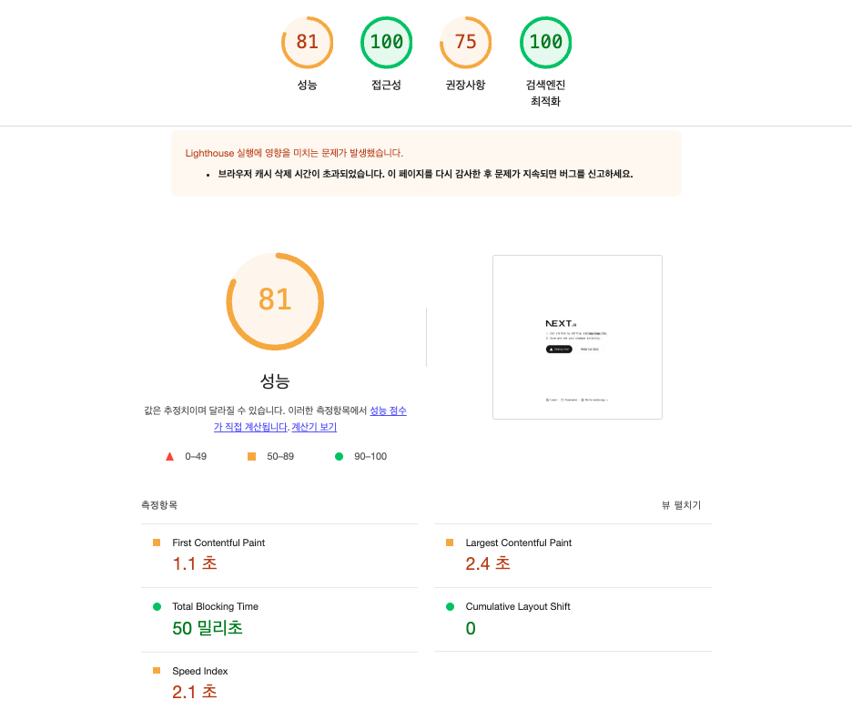
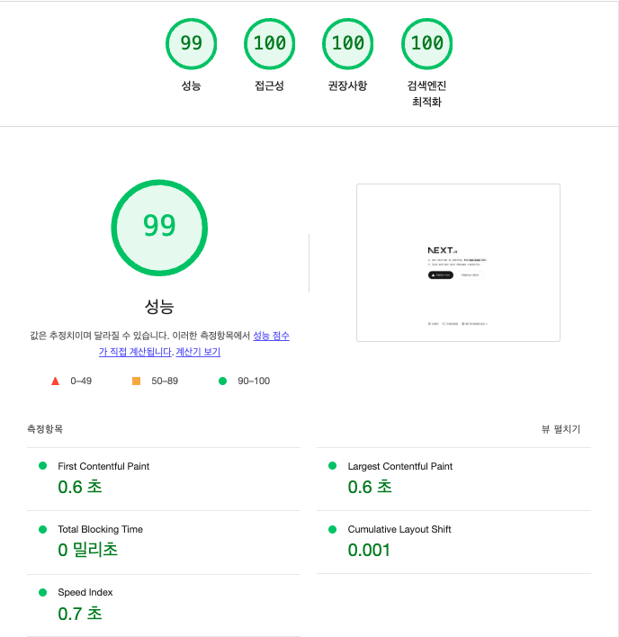
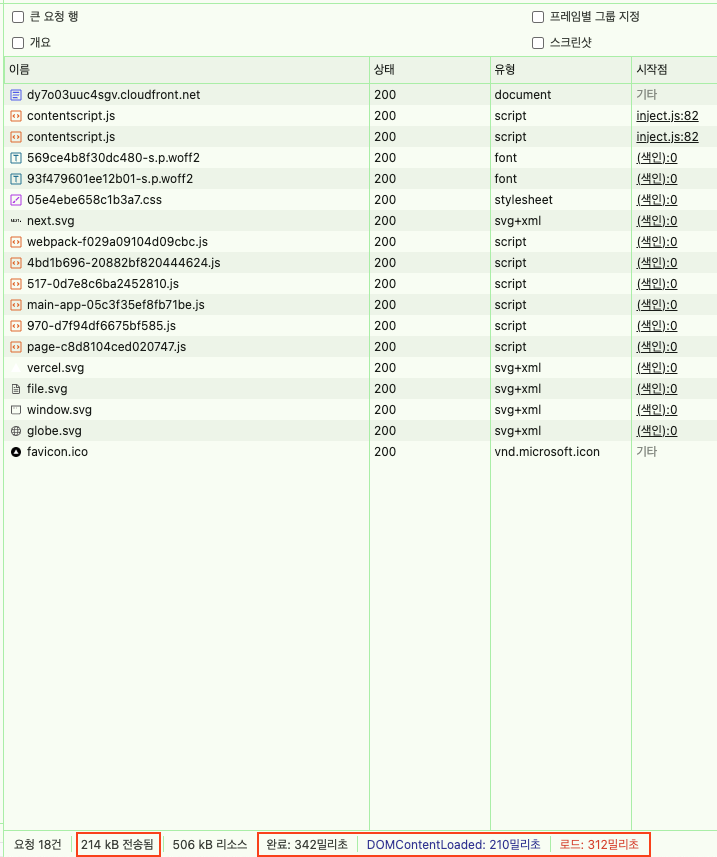

# CDN 최적화 보고서

## 인프라 최적화를 통해 기대하는 결과

아래의 3가지 목표를 달성하기 위해 CDN를 사용하였습니다.

1. 라이트하우스 성능 지표 개선
2. 네트워크 속도 최적화
3. 번들 사이즈 최적화

3가지 목표 달성을 파악하고 CDN을 통해 어떤 이점을 얻을 수 있는지 파악해보려고 합니다.

## 비교 환경

- AS-IS: [S3 버킷 웹사이트 엔드포인트](http://performance-juyoung.s3-website-us-east-1.amazonaws.com/)

- TO-BE: [CloudFront 배포 도메인 이름](https://dy7o03uuc4sgv.cloudfront.net/)

## S3와 CloudFront CDN 성능 비교

### LightHouse 측면

#### S3

#### CDN

#### LightHouse 점수 비교

| 항목            | CloudFront | S3    | 차이  |
| --------------- | ---------- | ----- | ----- |
| 성능            | 99점       | 81점  | +18점 |
| 접근성          | 100점      | 100점 | -     |
| 권장사항        | 100점      | 75점  | +25점 |
| 검색엔진 최적화 | 100점      | 100점 | -     |

#### 성능 지표 비교

| 항목                          | CloudFront | S3    | 차이       |
| ----------------------------- | ---------- | ----- | ---------- |
| FCP(First Contentful Paint)   | 0.6초      | 1.1초 | 0.5초 감소 |
| LCP(Largest Contentful Paint) | 0.6초      | 2.4초 | 1.8초 감소 |
| Total Blocking Time           | 0ms        | 50ms  | 0.05 감소  |
| CLS(Cumulative Layout Shift)  | 0          | 0     | -          |
| Speed Index                   | 2.1초      | 0.7초 | 1.4초 감소 |

#### 주요 개선사항

1. 전반적 성능 점수

- CloudFront 사용 시 99점으로 18점 향상
- 특히 권장사항 부분에서 25점 큰 폭 개선

2. 로딩 속도

- 초기 콘텐츠 표시 약 45% 개선
- 전체 콘텐츠 로딩 약 77% 개선

### 네트워크 속도 및 파일 크기

#### S3

#### CDN

| 항목         | CloudFront | S3     | 차이    |
| ------------ | ---------- | ------ | ------- |
| 총 로드 시간 | 312ms      | 1.73초 | -1.422s |
| DOM 로드     | 210ms      | 770ms  | -560ms  |
| 리소스 크기  | 214KB      | 512KB  | -298KB  |

### 주요 성능 차이점

1. 전체 로딩 속도

- CloudFront: 312ms로 로딩 속도 보여짐
- S3 직접 호스팅: 1.73초로 상대적으로 느린 속도
- CloudFront 사용 시 약 83.2% 성능 향상

2. 개별 리소스 로딩 시간

- Font 파일:

- CloudFront: 45ms
- S3:1119ms

- JavaScript 파일:
  - CloudFront: 13-21ms
  - S3: 324-855ms

3. 압축 및 최적화

- CloudFront는 더 효율적인 파일 압축을 보여줌
- 전송된 데이터 크기가 약 273KB 절감됨

### 결론

AWS의 CloudFront를 사용해보니 얻을 수 있는 이점은 다음과 같았습니다.

- 전체 페이지 로드 시간 단축
- DOM 컨텐츠 로드 시간 단축
- 더 효율적인 리소스 압축과 전송: 특히 큰 파일(폰트, 스크립트)에서 현저한 성능 향상
- LightHouse 성능 점수 향상
- 검색엔진 최적화 유지
